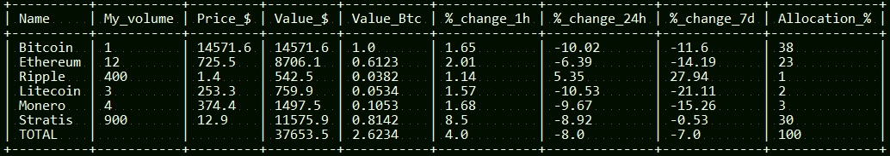

# Crypto Keep Tracking

Simple script to see info about your digital currencies :

Feel free to fork/contribute, 

### Todo:
- Make one yalm file extern with list all cryptocurrencies owned
- Set buyed price 
- Show benefice/losts, (green/red)
- Choose witch exchange(price)
- Make it dynamic (x minutes refresh) (problem is console is not remplacing the text, just writing more :( )